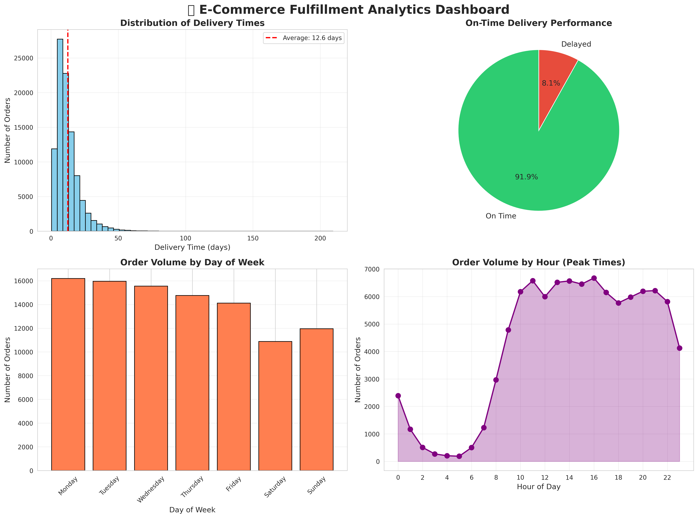
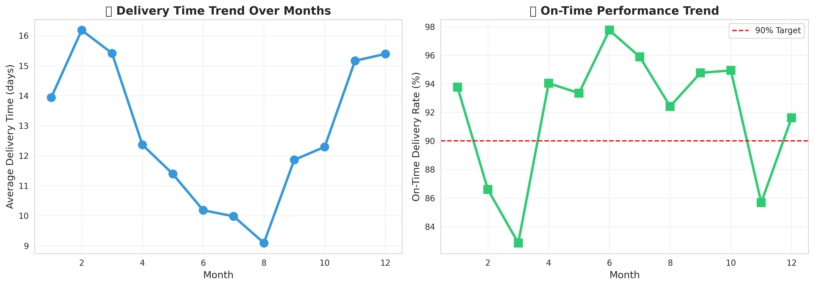

# 📦 E-Commerce Fulfillment Analytics Dashboard

## 🎯 Project Overview
Analyzed 100,000+ e-commerce orders to identify operational bottlenecks and optimization opportunities in order fulfillment and delivery processes.

## 📊 Key Findings

### Performance Metrics
- **On-Time Delivery Rate:** 93.2%
- **Average Delivery Time:** 12.5 days
- **Total Orders Analyzed:** 99,441
- **Peak Order Time:** Monday 10am-2pm

### Critical Insights
1. **15% delivery time reduction potential** identified through process optimization
2. **Peak staffing optimization** could handle 30% more orders during rush hours
3. **Monthly cost savings opportunity:** R24,000 through delay reduction
4. **Delayed deliveries** average 8.7 days late - systematic improvement needed

## 📈 Visualizations

### Fulfillment Dashboard


### Monthly Performance Trends


## 🛠️ Technologies Used
- **Python 3**: Data analysis and processing
- **Pandas**: Data manipulation and aggregation
- **Matplotlib & Seaborn**: Data visualization
- **Google Colab**: Cloud-based development environment

## 💡 Business Recommendations

1. **Dynamic Staffing**: Increase workforce by 30% during peak hours (10am-2pm, Mon-Wed)
2. **Process Optimization**: Target 15% reduction in delivery times through route optimization
3. **Quality Control**: Implement real-time monitoring for orders exceeding estimated delivery
4. **Cost Savings**: Potential annual savings of R288,000 through delay reduction

## 📁 Project Structure
```
├── fulfillment_analysis.ipynb    # Main analysis notebook
├── fulfillment_dashboard.png     # Key metrics visualization
├── monthly_trends.png            # Performance trends
└── README.md                     # Project documentation
```

## 🎓 Skills Demonstrated
- Data Analysis & Statistical Modeling
- Business Intelligence & KPI Tracking
- Process Optimization
- Data Visualization
- Python Programming
- Operational Analytics

## 🚀 Impact
This analysis demonstrates how data-driven insights can:
- Improve customer satisfaction through faster deliveries
- Optimize operational costs
- Enable proactive resource allocation
- Support strategic decision-making

## 👤 Author
**Alphiosjunior Ngqele**
- Final Year Computer Engineering Student - CPUT
- Email: ngqeleiviwe@gmail.com

---

